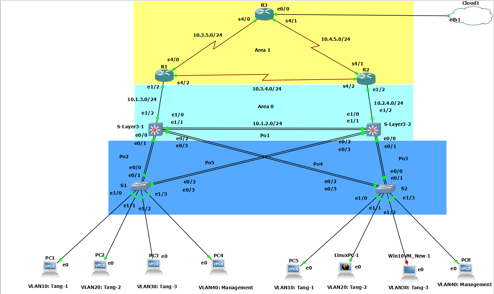

# BTL-Thiet-ke-hieu-nang-mang-PTIT

Lưu trữ LAB GNS3 môn Thiết kế hiệu năng mạng PTIT

\# Bổ trợ Đề tài: Thiết kế hiệu năng mạng (PTIT)

\## 📌 Giới thiệu dự án

Kho lưu trữ này chứa các tài liệu, mô hình giả lập và file cấu hình cho bài tập lớn môn \*\*Thiết kế hiệu năng mạng\*\* tại Học viện Công nghệ Bưu chính Viễn thông (PTIT).

\## 📁 Cấu trúc thư mục

\* `configs/`: Chứa file cấu hình thiết bị trong sơ đồ mạng.

\* `reports/`: Chứa báo cáo chi tiết của đề tài (định dạng PDF/Word).

\## 🛠 Công cụ sử dụng

\* Mô hình giả lập: GNS3

\* Thiết bị: Cisco IOS Router/Switch

